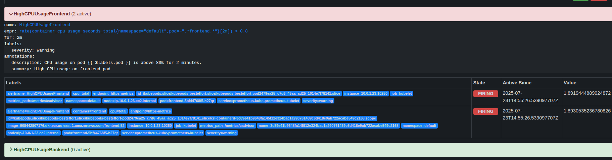
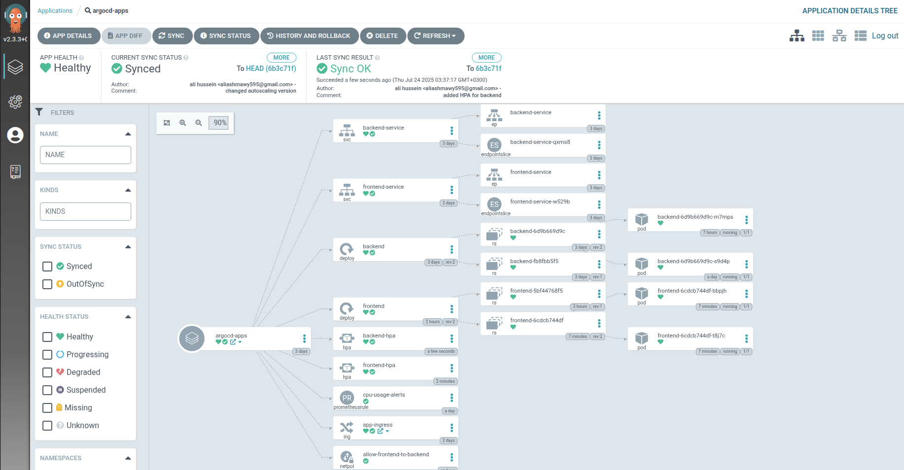

# ArgoCD Kubernetes Manifests

## 🎯 Directory Purpose

This directory contains Kubernetes manifests specifically tailored for use with ArgoCD, enabling GitOps-based continuous deployment for the application. ArgoCD monitors this directory for changes and automatically syncs the manifests to the Kubernetes cluster.

---

## 🔄 Integration with K8s_Manifest

- The **backend-deployment.yaml** and **frontend-deployment.yaml** files are originally sourced from the `K8s_Manifest` directory.
- When a new Docker image is built and pushed (e.g., by the CI/CD pipeline), the image tag is updated in these deployment files within the `argocd` directory.
- This allows ArgoCD to detect the change and deploy the updated image to the cluster, ensuring the latest version is always running.

---

## 🗂️ File Descriptions

### **frontend-deployment.yaml** & **backend-deployment.yaml**
- Define the deployment specifications for the frontend and backend services.
- The `image` field is updated with the latest tag as part of the CI/CD process.
- These files are the primary source for ArgoCD to deploy application updates.

### **frontend-HPA.yaml** & **backend-HPA.yaml**
- Define Horizontal Pod Autoscalers (HPA) for the frontend and backend deployments.
- **Prerequisite:** The Kubernetes Metrics Server must be installed for HPA to function. Install it with:
  ```bash
  kubectl apply -f https://github.com/kubernetes-sigs/metrics-server/releases/latest/download/components.yaml
  ```
- HPAs automatically scale pods based on CPU utilization targets.

### **ingress-nginx.yaml**
- Configures ingress rules for routing external traffic to the frontend and backend services.
- **S3 Access Logs:**
  - The annotation `alb.ingress.kubernetes.io/load-balancer-attributes` enables access logs for the AWS Application Load Balancer (ALB).
  - Logs are stored in the specified S3 bucket (`final-project-access-log-bucket`) with a defined prefix (`my-app`).
  - This is useful for auditing, monitoring, and troubleshooting ingress traffic.

### **front-to-back-policy.yaml**
- Implements Kubernetes NetworkPolicy to control traffic between frontend and backend pods, enhancing security by restricting communication paths.

### **cpu-usage-alerts.yaml**
- Defines alerting rules for CPU usage, enabling proactive monitoring and notification if resource usage exceeds defined thresholds.



### **service-frontend.yaml** & **service-backend.yaml**
- Define Kubernetes Service resources to expose the frontend and backend deployments within the cluster.
- Ensure stable networking and service discovery for the application components.

---

## 🚀 How ArgoCD Uses This Directory

- ArgoCD continuously watches this directory for changes.
- When a manifest (e.g., deployment or HPA) is updated, ArgoCD automatically applies the change to the cluster.
- This enables a true GitOps workflow: all cluster state is driven from version-controlled manifests.

---

## 🌳 ArgoCD Application Tree

Below is a screenshot of the ArgoCD application tree, which visually demonstrates how the application components are managed and deployed via ArgoCD:


